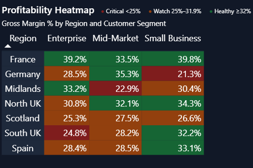

&lt;p align="center"&gt;
  &lt;img src="snapshots/CFO%20OVERVIEW.png" alt="Apex Distribution CFO Dashboard Preview" width="92%"&gt;
&lt;/p&gt;

&lt;h1 align="center"&gt;📊 Apex Distribution Ltd. — CFO Financial Dashboard&lt;/h1&gt;
&lt;p align="center"&gt;
  &lt;b&gt;Executive Financial Analytics Dashboard&lt;/b&gt; | Power BI | DAX | Power Query | Financial Storytelling
&lt;/p&gt;

&lt;p align="center"&gt;
  &lt;img src="https://img.shields.io/badge/Power%20BI-F2C811?style=for-the-badge&logo=powerbi&logoColor=black"&gt;
  &lt;img src="https://img.shields.io/badge/DAX-2563EB?style=for-the-badge"&gt;
  &lt;img src="https://img.shields.io/badge/Power%20Query-22C55E?style=for-the-badge"&gt;
  &lt;img src="https://img.shields.io/badge/Star%20Schema-9333EA?style=for-the-badge"&gt;
  &lt;img src="https://img.shields.io/badge/Financial%20Analytics-E11D48?style=for-the-badge"&gt;
  &lt;img src="https://img.shields.io/badge/Business%20Intelligence-0EA5E9?style=for-the-badge"&gt;
&lt;/p&gt;

---

## 📖 Table of Contents
- [Executive Summary](#-executive-summary)
- [Business Problem](#-business-problem)
- [Solution](#-solution)
- [Dashboard Features](#-dashboard-features)
- [Executive KPI Cards](#-executive-kpi-cards)
- [Financial Performance Bridge](#-financial-performance-bridge)
- [Business Performance Heatmap](#-business-performance-heatmap)
- [Dashboard Pages](#-dashboard-pages)
- [Data Model](#-data-model)
- [Power Query](#-power-query)
- [DAX Highlights](#-dax-highlights)
- [Tech Stack](#-tech-stack)
- [Skills Demonstrated](#-skills-demonstrated)
- [Key Insights](#-key-insights)
- [Repository Structure](#-repository-structure)
- [Future Improvements](#-future-improvements)
- [Why This Project Stands Out](#-why-this-project-stands-out)
- [Key Learnings](#-key-learnings)
- [About Me](#-about-me)

---

# 📖 Executive Summary

The **Apex Distribution Ltd. CFO Financial Dashboard** is a portfolio-grade Business Intelligence solution designed to replicate the analytical experience of a Chief Financial Officer (CFO).

Instead of relying on disconnected charts, this dashboard provides executives with a centralized command center for monitoring financial performance, identifying profitability drivers, evaluating operational efficiency, and supporting strategic decision-making.

The project combines **Power BI**, **DAX**, **Power Query**, and a **Star Schema** data model to transform raw financial transactions into interactive executive insights.

---

# 🎯 Business Problem

Financial leaders require timely and accurate insights without manually consolidating multiple reports.

This dashboard answers questions such as:

- How much Net Revenue did the business generate?
- Is Gross Profit improving?
- Where is profitability being lost?
- Which costs are increasing?
- Which business segments perform best?
- Which regions require management attention?

---

# 💡 Solution

The dashboard delivers an Executive Financial Command Center built around four key principles:

- **Executive KPI Monitoring** — At-a-glance financial health
- **Financial Storytelling** — Bridge from revenue to profit
- **Profitability Analysis** — Segment & regional heatmaps
- **Interactive Business Intelligence** — Dynamic filters, YoY, and time intelligence

Instead of overwhelming users with dozens of charts, every visual has been designed to answer a specific executive question.

---

# 🚀 Dashboard Features

✅ Executive KPI Cards with YoY comparisons  
✅ Financial Performance Bridge (Revenue → Profit)  
✅ Business Performance Heatmap (Region × Segment)  
✅ Dynamic Year-over-Year Analysis  
✅ Time Intelligence (PY, YoY Growth, Trends)  
✅ Dynamic Titles & Subtitles  
✅ Interactive Slicers & Filters  
✅ Conditional Formatting  
✅ Executive Dark Theme  
✅ Professional Financial Reporting  

---

# 📈 Executive KPI Cards

The Executive Overview highlights four critical financial KPIs.

| KPI | Business Purpose |
|------|------------------|
| 💰 Net Revenue | Total revenue generated after discounts |
| 📈 Gross Profit | Revenue remaining after COGS |
| 🏢 Operating Profit | Profit after Operating Expenses |
| 📊 Gross Margin % | Overall profitability percentage |

### Features
- Dynamic Prior Year Comparison
- Trend Indicators
- Dynamic Subtitles
- Conditional Formatting
- Executive KPI Design

&lt;p align="center"&gt;
  &lt;img src="snapshots/CFO%20OVERVIEW.png" alt="Executive KPI Cards" width="92%"&gt;
&lt;/p&gt;

---

# 🌉 Financial Performance Bridge

The Financial Bridge explains exactly how revenue becomes profit.

Unlike traditional dashboards that simply display totals, this visual tells the financial story.

Net Revenue
↓
Discounts
↓
COGS
↓
Gross Profit
↓
Operating Expenses
↓
Operating Profit

Each row contains:
- Current Value
- % of Revenue
- YoY Change
- Performance Status
- Conditional Formatting

This allows executives to understand exactly where money is earned and where it is spent.

  

---

# 🔥 Business Performance Heatmap

The heatmap identifies profitability across **Regions** and **Customer Segments**.

| Element | Description |
|---------|-------------|
| **Rows** | Region |
| **Columns** | Customer Segment |
| **Values** | Gross Margin % |

The heatmap instantly highlights:

🟢 High Margin Areas  
🟡 Moderate Performance  
🔴 Underperforming Business Units  

This enables management to focus on areas with the greatest business impact.

  

---

# 📑 Dashboard Pages

## 1️⃣ Executive Overview

Contains:
- Executive KPIs
- Financial Bridge
- Heatmap
- Interactive Filters

  

---

## 2️⃣ Customer & Product Analytics

Provides detailed analysis of:
- Customer Profitability
- Product Performance
- Revenue Contribution
- Regional Analysis
- Segment Analysis

  

  
  &nbsp;
  

---

## 3️⃣ CFO Review

Focuses on financial diagnostics including:
- Revenue Trends
- Expense Analysis
- Profitability Trends
- Executive Financial Review

  

  

---

# 🏗 Data Model

A professional **Star Schema** was implemented to improve scalability, maintainability, and DAX performance.

**Fact Tables**
- Revenue
- Expenses

**Dimension Tables**
- Calendar
- Customers
- Products

**Benefits:**
- Faster Queries
- Cleaner Relationships
- Better Time Intelligence
- Simpler DAX

  

---

# ⚙ Power Query

Power Query handled all ETL processes including:

- Data Cleaning
- Data Type Conversion
- Missing Value Handling
- Calendar Preparation
- Relationship Validation
- Data Transformation

---

# 🧮 DAX Highlights

Over **40+ DAX measures** were created throughout the project.

### Revenue
- Net Revenue
- Revenue PY
- Revenue YoY Growth

### Gross Profit
- Gross Profit
- Gross Profit PY
- Gross Margin %
- Gross Profit Trend

### Operating Profit
- Operating Profit
- Operating Profit PY
- Operating Profit Trend

### Dynamic Measures
- KPI Colors
- Dynamic Titles
- Dynamic Subtitles
- Trend Labels
- Conditional Formatting

### Financial Bridge
- Current Value
- % of Revenue
- YoY Change
- Performance Indicators

---

# 💻 Tech Stack

| Technology | Purpose |
|------------|---------|
| Microsoft Power BI | Dashboard Development |
| DAX | Business Logic |
| Power Query | ETL |
| CSV | Data Source |
| Star Schema | Data Modeling |

---

# 📌 Skills Demonstrated

### Business Intelligence
- Executive Dashboard Design
- KPI Development
- Financial Reporting
- Business Storytelling

### Power BI
- Data Modeling
- Relationships
- DAX
- Power Query
- Time Intelligence
- Conditional Formatting

### Finance
- Net Revenue
- Gross Profit
- Operating Profit
- Gross Margin
- Cost Analysis
- Year-over-Year Analysis

---

# 📊 Key Insights

The dashboard enables executives to answer:

- Is revenue increasing?
- Are margins improving?
- Which costs are rising?
- Which customer segments perform best?
- Which regions require attention?
- How has performance changed compared to last year?

---

# 📂 Repository Structure

Apex-CFO-Financial-Dashboard/
│
├── README.md
├── Dashboard/
│   └── Apex CFO Financial Dashboard.pbix
├── Data/
├── Documentation/
├── Assets/
├── snapshots/
│   ├── CFO OVERVIEW.png
│   ├── CFO REVIEW CHART.png
│   ├── CFO Review.png
│   ├── CFO customer & product.png
│   ├── CUSTOMER REV.png
│   ├── FINANCIAL PERFORMANCE.png
│   ├── HEATMAP.png
│   ├── PRODUCT PROFITABILITY.png
│   └── START SCHEMA.png

---

# 🚀 Future Improvements

Potential enhancements include:

- Budget vs Actual Reporting
- Forecasting
- Cash Flow Dashboard
- EBITDA Analysis
- AI Insights
- Row-Level Security
- Incremental Refresh
- Power BI Service Deployment

---

# ⭐ Why This Project Stands Out

Unlike traditional Power BI dashboards that primarily focus on descriptive reporting, this project was designed to emulate a real **Executive Financial Command Center**.

**Key differentiators:**

- Executive-level financial storytelling
- Dynamic KPI cards with Year-over-Year comparisons
- Financial Performance Bridge explaining how profit is generated
- Business Performance Heatmap highlighting profitability by Region and Customer Segment
- Professional Star Schema data model
- Advanced DAX calculations
- Interactive executive reporting
- Clean enterprise-inspired dashboard design

This project demonstrates both **technical Power BI proficiency** and **strong business understanding**.

---

# 📚 Key Learnings

Through this project I strengthened my understanding of:

- Executive Dashboard Design
- Financial Reporting
- DAX Optimization
- Star Schema Modeling
- Power Query
- KPI Development
- Business Storytelling
- Financial Analytics

---

# 👨‍💻 About Me

I am an aspiring Data Analyst and Business Intelligence Developer passionate about transforming raw data into meaningful business insights.
This project showcases my ability to combine technical expertise with financial analysis to build executive-level analytical solutions.
If you're a recruiter, hiring manager, or fellow data professional, I'd be happy to connect and discuss Business Intelligence, Data Analytics, or future opportunities.

---

⭐ **If you found this project useful, consider giving it a Star!**
